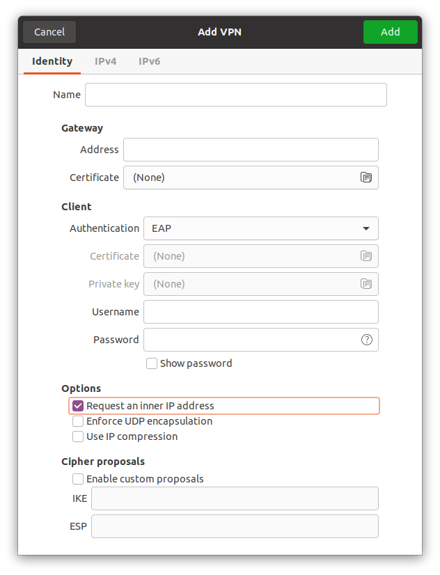

# Linux

## Ubuntu 18.04, 20.04, 22.04

1. Go to Settings / Network.

   

2. Click on the '+' button to the right of the 'VPN' section header.

   

3. Click on 'IPsec/IKEv2 (strongswan)'.

   

4. Complete the form with the following details:

   |Name |Value
   |- |-
   |Name |{{vpn_connection_name}}
   |Gateway |
   |- Address |{{vpn_server_name}}
   |- Certificate |(None)
   |Client |
   |- Authentication |EAP
   |- Username |_(fill in your username)_
   |- Password |_(fill in your password)_ [^store-password]
   |Options |
   |- Request an inner IP address |yes
   |- Enforce UDP encapsulation |no
   |- Use IP compression |no

   [^store-password]: Click on the '?' icon and select 'Store the password only for this user'.

5. Click on the 'Add' button.
