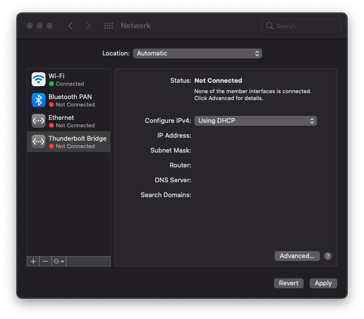
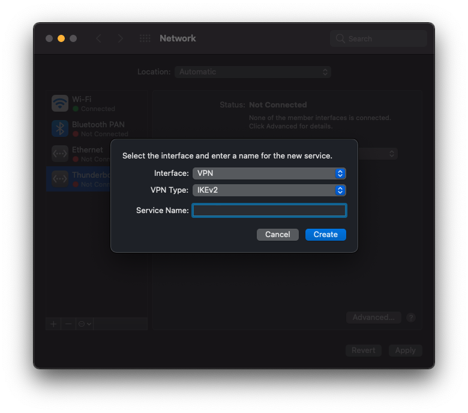
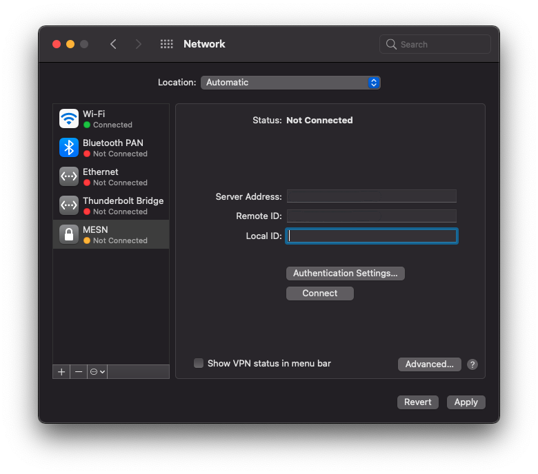
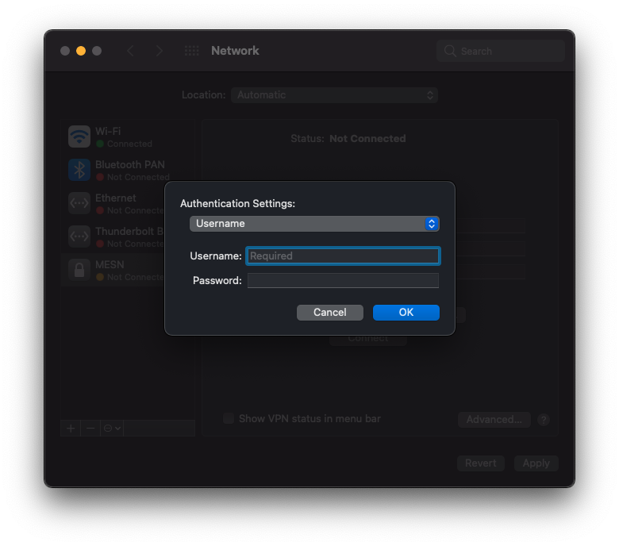

# MacOS

1. Go to System Preferences / Network.

   

2. Click on the '+' button in the bottom left corner of the dialog.

   

3. Fill up the dialog as follows:

   |Name |Value
   |- |-
   |Interface |VPN
   |VPN Type |IKEv2
   |Service Name |{{vpn_connection_name}}

4. Click on the 'Create' button.

   

5. Fill up the VPN connection details as follows:

   |Name |Value
   |- |-
   |Server Address |{{vpn_server_name}}
   |Remote ID |{{vpn_server_name}}
   |Local ID |_(leave blank)_

6. Click on the 'Authentication Settings...' button.

   

7. Fill the authentication settings dialog as follows:

   |Name |Value
   |- |-
   |Authentication Settings| Username
   |Username |_(fill in your username)_
   |Password |_(fill in your password)_

8. Click on the 'OK' button.

9. Click on the 'Apply' button.
