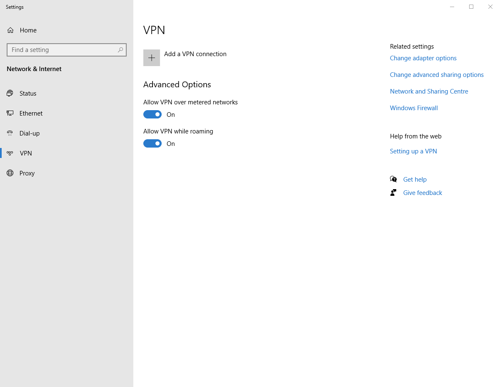
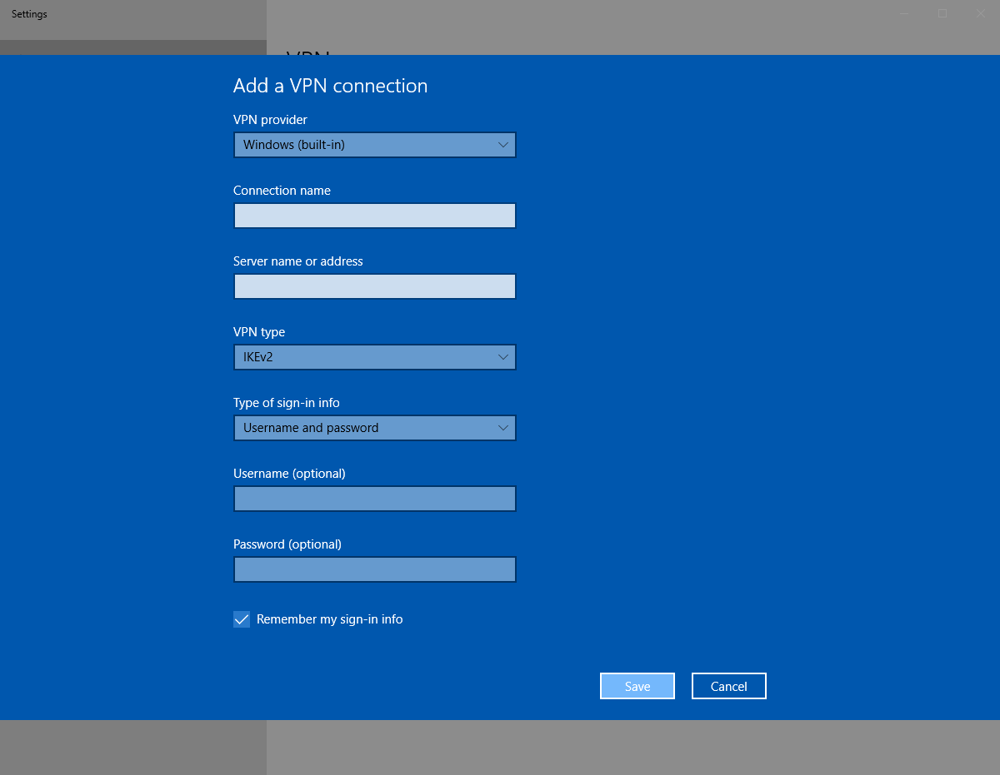

# Windows 10

1. Go to Settings / VPN.

   

2. Click on the 'Add a VPN connection' button.

   

3. Complete the form with the following details:

   |Name |Value
   |- |-
   |VPN provider |Windows (built-in)
   |Connection name |{{vpn_connection_name}}
   |Server name or address |{{vpn_server_name}}
   |VPN type |IKEv2
   |Type of sign-in info |Username and password
   |Username |_(fill in your username)_
   |Password |_(fill in your password)_
   |Remember my sign-in info |yes

4. Click on the 'Save' button.

```admonish warning
The VPN connection will take over your network.
You will not be able to access other networks.
```
